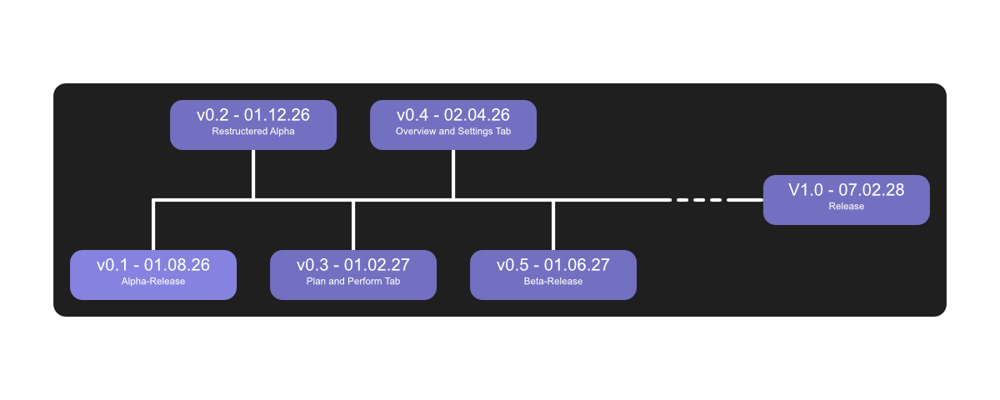

# Tasker

A Task-Planner and Tracker to help you understand your own work behavior.

| **[Features](./FEATURES.md)** | **[Changes](./CHANGELOG.md)** | **[Documentation](./github-content/documentation/quick%20start.md)** | **[License](./LICENSE)** |

# Development Status

## Current

**WARNING! The project has reached the alpha-phase. Downloaded Versions could potentially crash or create errors.**

It's ready! A first testable version of the program is now downloadable. After reaching the alpha-version I'm going to concentrate on other projects.
I'm still going to add new functions, fix bugs and try to optimise the code.
Though most of it might have to wait until October, because I'm out of time in September already.
I've added added a roadmap now, which shows the planned versions, I'm going to release until version 1.0 is completed. If a version is not stable enough to be released in time, I'm going to postpone the release. I also might change the roadmap a little depending on my development speed.
If you find any errors or need help with something, you can sent an [e-mail](mailto://info@vindona.de) or create an issue here on Github.

## Roadmap

# Table of Contents
   
* [Planned Releases](#planned-releases)

    * [Pre-Alpha](#pre-alpha)

    * [Alpha](#alpha-release)

    * [Beta](#beta-release)

    * [Full Release](#release-v10)

* [Ideas for features after full release](#ideas-for-features-after-release)

*Searching for installation, updates, user data and other information? You can find them now in the [documentation](./github-content/documentation/quick%20start.md)*

# Planned Releases

## Pre-Alpha

- [x] Create Github Project
- [x] Update design
    - [x] Redefine layout and design
- [x] Create basic functionality
    - [x] Read and write to the database (through SQLite-commands)
    - [x] Create Logic for m to n connections in database (like delete, create, etc.)
    - [x] Create classes and commands for interactions with the database
    - [x] Create layout
    - [x] Connect layout with commands and classes
    - [x] Start and stop function for the tasks
    - [x] Detailed view for tasks and appointments
    - [x] Column for duration data
- [x] Refine code
- [x] Fixing bugs

*Phase has been completed.*

## Alpha-Release
*More objectives may be added while working on the program*

- [ ] Update design
    - [ ] Move color definitions to external class
    - [ ] Create switchable designs
- [ ] New Features
    - [ ] Export Data
    - [ ] Start and stop of worktime (for each category)
    - [ ] Worktimelimits
    - [ ] Restructuring of DataBase Class
    - [ ] Detailed View for Projects and Categories
    - [ ] Show current worktime in category
    - [ ] Algorithm to help you plan your new tasks and appointments
    - [ ] Automatically show hidden task-ids, to differentiate between tasks, which have the same title and are in the same category and project
    - [ ] Archive Projects, so you don't see them anymore, but can still get access to the data
    - [ ] Overviewpage
    - [ ] Customizable settings
        - [ ] Shortcuts
        - [ ] Autodelete data
            - [ ] After a certain amount of time
            - [ ] After a certain amount of disk space is used
            - [ ] Deactivate Autodelete
        - [ ] Always show hidden task ids
- [ ] Optimisations for different user types (profiles)
    - [ ] Standard
    - [ ] People with ADHD
    - [ ] People with Autism
    - [ ] People with Audhd
    - [ ] ... (more will follow soon)
- [ ] Refine code
- [ ] Fixing more bugs

*A finishing date has not been set for now.*

## Beta-Release

*More objectives may be added while working on the program*

- [ ] Update design
    - [ ] Enable custom designs
- [ ] New Features
    - [ ] Plugins
    - [ ] New Languages
        - [ ] German
    - [ ] Task Merger
        - [ ] Function to merge selected tasks
        - [ ] automatically recommands tasks to merge, which are in the same category, same project and have the same title
            - [ ] option, to ignore those recommendations
            - [ ] filter, to show ignored recommendations
- [ ] Update Features
    - [ ] Refine Algorithm
- [ ] Create guides
    - [ ] Online user guide (detailed)
    - [ ] Built in guide for beginners
- [ ] Create documentations
    - [ ] For developer
        - [ ] program/app development
        - [ ] plugin development
    - [ ] For designer
- [ ] Refine code
- [ ] Fixing even more bugs

*A finishing date has not been set for now.*

## Release (V1.0)

*A finishing date has not been set for now.*

# Ideas for Features after release

*These are only ideas for now, nothing promised.*

- [ ] Selfhostable version for the browser
- [ ] Server synchronisation for database
- [ ] AI Assistant for new tasks (only locally on your machine)
- [ ] A few funny rewards for doing your tasks!
    - [ ] You can create them yourself or let the program recommend you something
    - [ ] The Program has built-in Mini-Games, which act as a reward
- [ ] Reminders for Worktimes during Work

*This and all text in the documentation, changelog and features files have been created without the usage of ai.*

**this project is developed by Elmaron from Vindona**
