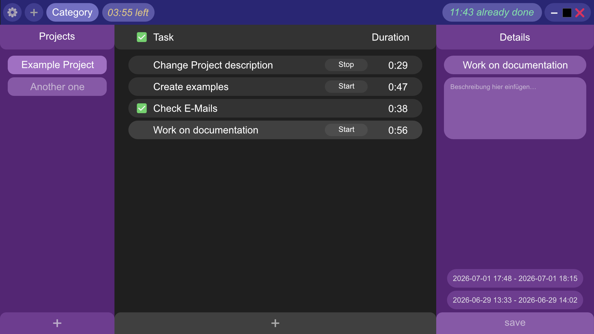

# Tasker

Ein Aufgaben-Planner und Tracker, der dir hilft, dein Arbeitsverhalten zu verstehen.

*This is the german translation. You can find the readme in english [here](../README.md).*

# Entwicklungsstatus

## Aktuell

**ACHTUNG! Das Projekt befindet sich in der Alpha-Phase. Heruntergeladene Versionen könnten Abstürzen oder Fehler verursachen.**

Es ist soweit! Eine erste testbare Version des Programms ist fertig. Angekommen in der Alpha-Version werde ich nun etwas weniger Zeit ins Projekt stecken.
Trotzdem werde ich weiterhin regelmäßig neue Funktionen hinzufügen, Fehler beheben und den Code optimieren.
Bei gefundenen Fehlern, würde ich mich sehr über eine [Mail](mailto://info@vindona.de) freuen!

Status: *[Prealpha](#pre-alpha)*| **[Alpha](#alpha-release)** | [Beta](#beta-release) | [Release](#veröffentlichung-v10)

*abgeschlossen*; **in Bearbeitung**; Nächste Phase

# Inhaltsverzeichnis

* [Funktionen](#funktionen)

    * [Eine Stellungnahme zum Thema KI](#eine-stellungnahme-zum-thema-ki)

        * [Entwicklung](#entwicklung)

        * [KI-Assistent](#ki-assistent)
    
    * [Geplante Inhalte](#geplante-inhalte)

        * [Pre-Alpha](#pre-alpha)

        * [Alpha](#alpha-release)

        * [Beta](#beta-release)

        * [Release](#veröffentlichung-v10)

        * [Nach der Veröffentlichung](#planung-für-nach-der-veröffentlichung)

* [Installation](#installation)

* [Updates](#updates)

* [Benutzerdaten](#benutzerdaten)

* [Farben](#farben)

# Funktionen

Dieses Aufgaben-Planungs-Programm verwendet eine lokale Datenbank, um deine Aufgaben zu verfolgen. Die Daten, die dabei gesammelt werden, benutzt das Programm, um deine zukünftigen Aufgaben und Termine zu planen, falls du diese schon einmal erledigt hast.

Das Programm soll auch Menschen helfen, die es schwierig finden, eine Aufgabe "einfach zu tun", mit einer Aufgabe anzufangen und produktiv zu werden, falls das ein Problem ist. Trotzdem sind das nur Empfehlungen, die dir mehr Perspektiven geben sollen, um bei Dingen aktiver werden zu können, die "getan werden müssen".

Am Ende soll das Programm dem Benutzer helfen, sich zwischen Aufgaben zu entscheiden, die getan werden müssen und diese zu tun.

## Eine Stellungnahme zum Thema KI

Grundsätzlich bin ich *nicht* gegen neue Technologien. Das gilt auch für das Thema KI. **Allerdings** finde ich die Verwendung von KI in den meisten Fällen überflüssig und unangemessen. Deshalb möchte ich hier erklären, *wie* und *ob* ich KI während der Entwicklung einsetze und was man in Zukunft erwarten kann, wenn KI in Verbindung mit dem Programm genutzt wird.

### Entwicklung

Während der Entwicklung kann KI definitiv die Produktivität erhöhen, wenn diese Teile des Codes selbst schreibt. Das ist ein Fakt, den ich **nicht** widerlegen kann. Trotzdem mag ich die Idee nicht, dass *etwas* anderes meinen Code schreibt. Stattdessen benutze ich KI für die folgenden Dinge bei der Entwicklung:
* Um neue Befehle zu erlernen
* Um einen Befehl zu finden, von dem ich nicht wusste, dass es ihn gibt
* Um die Basics von etwas neuem zu verstehen (bspw. Befehlen, Bibliotheken, etc.)
* Um den Grund für ein Problem zu finden, den ich nicht finden kann

Wenn ich etwas neues lernen muss, um bspw. die Avalonia Bibliothek zu nutzen, schaue ich mir zuerst die Dokumentation an. Wenn ich nach einer Weile nicht in der Lage dazu bin, die Konzepte zu verstehen, benutze ich KI als Hilfe. Oft lerne ich über diesen Weg andere, mir unbekannte Befehle und/oder Bibliotheken kennen. Also wiederhole ich den Prozess, bis ich genug verstehe, um die Konzepte anwenden zu können.

Falls ich bei einem Problem einen Fehler bekomme, bei dem ich den Grund des Fehlers nicht nachvollziehen kann, frage ich ggf. KI, um das Problem identifizieren zu können. Bevor ich den Code jedoch an die KI übergebe, versuche ich den gesamten Code umzuschreiben, damit die KI nicht so einfach nachvollziehen kann, was ich genau mache (bspw. benenne ich Variablen um; schicke der Ki nur, was sie braucht; usw.) Leider schreibt KI in der Antwort immer die Lösung für das Problem mit hinzu, selbst wenn ich nicht danach frage. Darum ignoriere ich sie meistens. Ich kopiere nie einfach den Code der KI. Falls ich Code-Ausschnitte benutze, schaue ich sie mir zuerst genau an, bis ich diese verstanden habe und tippe sie dann in mein eigenes Programm selbst ein. Ich verwende KI nicht, um meinen Code zu verbessern.

Ich könnte KI natürlich mehr benutzen, so wäre ich bei allem deutlich schneller. Ich möchte jedoch alles verstehen, was ich tue. Genauso wenig möchte ich dümmer werden. Deshalb benutze ich KI, wie ich es eben tue. Ich werde immer versuchen, die Fehler selbst zu verstehen, bevor ich darüber nachdenke, eine KI anzufragen. In Zukunft möchte ich mich auch deutlich mehr auf Stackoverflow oder ähnliches verlassen.

Falls du mehr über dieses Thema wissen möchtest, kannst du mir gerne eine [Mail](mailto:info@vindona.de) schreiben (schnellste Antwort).

### KI Assistent

Grundsätzlich ich finde die Idee eines KI Assistenten **nicht** verwerflich. **Aber nicht** als "Ich kann dich alles fragen und du machst das"-Programm. Ich finde die Idee, ein anderes KI-Programm zu benutzen oder einen Server oder irgendetwas außerhalb für anzuschreiben, ebenfalls schlecht. **Aktuell plane ich nicht, einen KI Assistenten in das Programm einzubauen.**
Falls ich es doch machen sollte, dann sind hier die Dinge, die du von dem Assistenten erwarten und nicht erwarten kannst: 

* Der KI Assistent wird entweder ins Programm integriert oder als Plugin verfügbar sein.
* Der Assistent kann komplett ausgeschaltet werden.
* Die KI ist nur lokal verfügbar und kann sich nicht mit anderen KIs in Verbindung setzen.
    * Falls du eine selbstgehostete Version für Browser verwendest, läuft der Assistent nur auf deinem Server und kann sich nicht mit anderen KIs in Verbindung setzen.
* Du wirst immer transparente Informationen dazu bekommen, was der KI Assistent macht und was nicht.
    * Der Assistent ist als Alternative zum Algorithmus verfügbar, um deine Zeiten bei Aufgaben besser zu analysieren.
    * Der Assistent kann die Aufgaben (für verschiedene Tage) vorschlagen, aber wird sie nicht für dich planen.
    * Der Assistent kann **nicht** den Inhalt deiner Aufgaben analysieren, um die auf dieser Basis neue Aufgaben vorzuschlagen, falls du noch welche gebrauchen könntest.
    * Du kannst nicht in einem Chat mit der KI interagieren.

## Geplante Inhalte

### Pre-Alpha

- [x] Github Projekt erstellen
- [x] Design überarbeiten
    - [x] Layout und Design neu entwerfen
- [x] Erstelle die Grundfunktionen
    - [x] Lese- und Schreibfunktionen für die Datenbank (durch SQLite-Befehle)
    - [x] Logik für die m zu n Beziehungen in der Datenbank erstellen (fürs erstellen, löschen, usw.)
    - [x] Erstelle Klassen und Befehle für die Interaktion mit der Datenbank
    - [x] Erstelle Layout
    - [x] Verknüpfe das Layout mit den Befehlen und Klassen
    - [x] Starten bzw. Stoppen der Arbeiten an einer Aufgabe
    - [x] Detailansicht für eine Aufgabe bzw. einen Termin
    - [x] Spalte für die Bearbeitungszeit einer Aufgabe
- [x] Überarbeite den Code
- [x] Behebe Fehler

*Phase ist abgeschlossen.*

### Alpha-Release

*Mehr Punkte könnten hinzugefügt werden, während ich an dem Programm arbeite.*

- [ ] Design-Funktionen überarbeiten
    - [ ] Bewege Farben in eine externe Klasse
    - [ ] Erstelle wechselbare Designs
- [ ] Neue Funktionen
    - [ ] Daten exportieren
    - [ ] Starten und Stoppen der Arbeit (pro Kategorie)
    - [ ] Arbeitszeitlimiterungen
    - [ ] ReStrukturierung der Datenbank Klasse
    - [ ] Appointments können nun als solche hinzugefügt werden (mit Detailansicht)
    - [ ] Detailansicht für Projekte und Kategorien
    - [ ] Anzeige für die aktuelle Arbeitszeit in einer Kategorie
    - [ ] Algorithmus, um beim planen neuer Aufgaben und Termine zu helfen
    - [ ] Zeige automatisch versteckte Aufgaben-IDs an, falls es zwei unterschiedliche Aufgaben mit dem gleichen Titel in derselben Kategorie und demselben Projekt gibt
    - [ ] Archiviere Projekte, sodass du sie nicht sehen kannst, aber noch Zugriff auf die Daten bekommen kannst
    - [ ] Übersichtseite
    - [ ] Veränderbare Einstellungen
        - [ ] Tastaturbefehle
        - [ ] Automatisches Löschen der lokalen Daten
            - [ ] Nach einer bestimmten Zeit
            - [ ] Nachdem die Daten eine bestimmte Größe auf der Festplatte erreicht haben
            - [ ] Deaktiveren des automatischen Löschens von Daten
        - [ ] Zeige immer die versteckten Aufgaben-IDs an
- [ ] Optimierungen für verschiedene Benutzerarten
    - [ ] Standard
    - [ ] Menschen mit ADHS
- [ ] Überarbeite den Code
- [ ] Behebe mehr Fehler

*Es wurde noch kein Datum fürs beenden der Phase angesetzt.*

### Beta-Release

*Mehr Punkte könnten hinzugefügt werden, während ich an dem Programm arbeite.*

- [ ] Design-Funktionen überarbeiten
    - [ ] Ermögliche eigene Designs
- [ ] Neue Funktionen
    - [ ] Plugins
    - [ ] Neue Sprachen
        - [ ] Deutsch
    - [ ] Aufgaben Vereinfacher
        - [ ] Funktion, um Aufgaben zu verbinden, die selbst ausgewählt werden
        - [ ] schlägt Aufgaben vor, die in der selben Kategorie und dem gleichen Projekt sind und den gleichen Titel tragen, sodass diese vereint werden können
            - [ ] Option, um das Anzeigen dieser Vorschläge zu ignorieren
            - [ ] Filteroption, um ignorierte Vorschläge anzuzeigen
- [ ] Funktions-Updates
    - [ ] Verbesserungen am Algorithmus
- [ ] Erstelle Benutzerhilfen
    - [ ] Online Benutzerhilfe (detailiert)
    - [ ] Eingebaute Hilfe für Anfänger
- [ ] Erstelle Dokumentationen
    - [ ] Für Entwickler
        - [ ] Programm-/Appentwicklung
        - [ ] Pluginentwicklung
    - [ ] Für Designer
- [ ] Überarbeite den Code
- [ ] Behebe noch mehr Fehler

*Es wurde noch kein Datum fürs beenden der Phase angesetzt.*

### Veröffentlichung (V1.0)

*Es wurde noch kein Datum fürs beenden der Phase angesetzt.*

## Planung für nach der Veröffentlichung

*Im Moment sind dies nur Ideen, nichts ist versprochen.*

- [ ] Selbstgehostete Version für den Browser
- [ ] Server Synchronisation für die Datenbank
- [ ] KI Assistent für neue Aufgaben (nur auf deinem Gerät)
- [ ] Ein paar lustige Belohnungen für das erfüllen deiner Aufgaben!
    - [ ] Du kannst selbst welche erstellen oder das Programm dir welche empfehlen lassen
    - [ ] Das Programm hat eingebaute kleine Mini-Spiele, die belohnend sein sollen
- [ ] Erinnerungen für die Arbeitszeiten während der Arbeit

# Installation

Lade dir [hier](https://www.github.com/Elmaron/Tasker/Releases) passende Version für den Betriebssystem herunter. Führe diese dann mit einem Doppelklick aus (setup.exe unter Windows).

Solltest du Windows verwenden und dir unsicher sein, ob du ein x64 oder arm64 Gerät verwendest, kannst du die Windows Systemeinstellungen öffnen und unter "System > Info" in der Geräteinfo nach dem Begriff "Systemtyp" suchen. Wenn dort so etwas steht wie "64-Bit-Betriebssystem, ARM-basierter Prozesser", lädst du dir das Setup für win-arm64 herunter.

Folgende Versionen stehen zur Auswahl:

* Windows (64-Bit-Betriebssysteme)
    * Tasker für ARM-basierte Prozessoren
        * Als Setup (release-setup.exe)
        * Als Portable Version (release-portable.zip)
    * Tasker für x64-basierter Prozessor
        * Als Setup (release-setup.exe)
        * Als Portable Version (release-portable.zip)

* Linux
    * Für 64-Bit-Betriebssysteme, ARM-basierter Prozessor
        * AppImage (für alle Linux Distributionen)
    * Für 64-Bit-Betriebssysteme, x64-basierter Prozessor
        * AppImage (für alle Linux Distributionen)

# Updates

Die App hat eine interne Update-Funktion. Drücke in der Anwendung oben rechts auf den "Update"-Button, um zu prüfen, ob ein Update verfügbar ist.

Ist ein Update verfügbar, lädt die App dieses im Hintergrund herunter und schließt die App dann automatisch, um das Update zu installieren.

Die App wird niemals Updates ohne Einverständnis installieren. Solltest du den Update-Button betätigen, gibst du damit auch deine Erlaubnis für die Installatione eines Updates frei.

# Benutzerdaten

Die App speichert die Datenbank im lokalen App-Speicher deines Betriebsystems.

In folgendem Ordner befinden sich die Daten:

* Unter Windows: %LocalAppData%\Tasker (Einfach im Explorer in die Leiste oben kopieren)

Um die Daten zu sichern, kannst du "appData.db" einfach an einen anderen Speicherplatz kopieren. Um die Daten wiederherzustellen, brauchst du nur die Datei nur wieder an ihren ursprünglichen Platz zu schieben. Solltest du die Datei umbenennen, denke daran, sie in "appData.db" zurückzubenennen.
Um eine leere Datenbank zu erzeugen, lösche "appData.db" aus dem Ordner. Das Programm erzeugt automatisch eine neue Datenbank.

# Farben

Das Programm soll nach Möglichkeit auch Barrierefreiheit werden. Dementsprechend habe ich eine neue Farbpalette mit dem letzten Update hinzugefügt. Ich habe allerdings noch nicht geprüft, ob diese Barrierefrei ist. Falls du selbst an einer Farbfehlsichtigkeit leidest, schick mir doch gerne Feedback an meine [Mail](mailto://info@vindona.de)!

Alle Farben werden von links nach rechts dunkler. Die Sättigung ist an den Rändern höher als in der Mitte. Beim Hintergrund liegt die Sättigung bei 0%. Bei Primär, Sekundär und Hintergrund ist der Farbgrad der gleiche. Bei Schwierigkeit und Priorität verschiebt sich der Farbgrad.

*Dieser Text wurde ohne die Verwendung von AI geschrieben.*

**dieses Projekt wird von Elmaron (Vindona) entwickelt**
